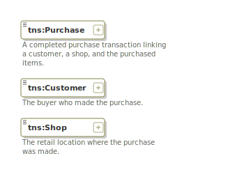
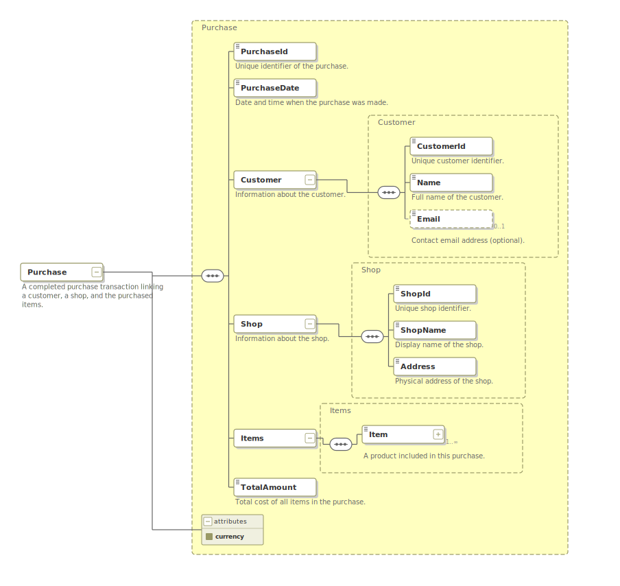

# xsd-diagram-mcp

MCP server for **XSD schema visualization** — generates SVG diagrams in [Altova XMLSpy](https://www.altova.com/xmlspy-xml-editor) notation.

Use it with **Claude Desktop**, **VS Code Copilot**, or any MCP-compatible client to visualize XML Schema (XSD) files directly in your AI conversations.

## What it does

Given an XSD file, this server can:
- **Parse** the schema into a structured JSON representation
- **Render element diagrams** — tree view of an element with its children, attributes, and type hierarchy
- **Render overview diagrams** — all top-level elements at a glance
- **List all constructs** — elements, complex types, simple types with their annotations

Diagrams use the industry-standard Altova XMLSpy visual notation:
- Solid borders = required elements, dashed = optional
- Sequence/choice/all compositor icons
- Multiplicity labels (0..∞, 1..∞, 0..1)
- Namespace prefixes
- Annotations displayed under elements

## Quick start

### Install

```bash
pip install git+https://github.com/dborozdin/xsd-diagram-mcp.git
```

### Configure Claude Desktop

Add to your `claude_desktop_config.json`:

```json
{
  "mcpServers": {
    "xsd-diagram": {
      "command": "xsd-diagram-mcp"
    }
  }
}
```

### Configure VS Code (Copilot / Claude extension)

Add to your `.vscode/mcp.json`:

```json
{
  "servers": {
    "xsd-diagram": {
      "command": "xsd-diagram-mcp"
    }
  }
}
```

## Available tools

| Tool | Description | Parameters |
|------|-------------|------------|
| `parse_xsd` | Parse XSD into JSON structure | `schema_path` (str) |
| `render_xsd_diagram` | SVG diagram for a specific element | `schema_path` (str), `root_element` (str), `depth` (int, 0-5, default 2) |
| `render_xsd_overview` | Overview SVG of all top-level elements | `schema_path` (str) |
| `list_xsd_elements` | JSON list of elements, types, attributes | `schema_path` (str) |

## Usage examples

In Claude or Copilot chat:

> "Show me a diagram of the `Order` element in `purchase_order.xsd` with 3 levels of depth"

> "List all elements and types in `my_schema.xsd`"

> "Generate an overview diagram of `catalog.xsd`"

## Use cases

- **Schema exploration** — understand complex XSD structures visually during development
- **Documentation generation** — create SVG diagrams for technical documentation
- **Code review** — visualize schema changes in pull requests
- **Learning** — explore public XSD standards (OASIS, ISO, W3C) interactively

## Example: generating schema documentation

The `examples/purchase/` directory contains a complete working example — an annotated XSD schema and a script that produces an HTML documentation page with descriptions and SVG diagrams.

<details>
<summary>🇷🇺 По-русски</summary>

В папке `examples/purchase/` находится готовый пример — аннотированная XSD-схема и скрипт, который создаёт HTML-страницу с описаниями элементов и SVG-диаграммами.

</details>

**Files:**
- `purchase.xsd` — sample schema with annotated elements (Customer, Shop, Purchase)
- `generate_doc.py` — script that calls MCP tools and assembles HTML
- `purchase_doc.html` — the resulting documentation (with EN/RU toggle)

### Source: XSD schema overview

The schema defines three top-level elements — Purchase, Customer, and Shop — each with annotations describing their purpose:



### Result: element diagram with annotations

The `generate_doc.py` script (or an LLM via MCP) produces an HTML page where each element gets a description from its annotation and an SVG diagram. The page has an EN/RU language toggle:



The full result is in [`purchase_doc.html`](examples/purchase/purchase_doc.html) — open it in a browser to see all sections and switch languages.

### Try it yourself

**1. Generate documentation programmatically:**

```bash
python examples/purchase/generate_doc.py
# → examples/purchase/purchase_doc.html
```

**2. Or ask your LLM via MCP:**

> "Open `examples/purchase/purchase.xsd`, read the annotations for all elements,
> then generate an HTML page with a description of each element
> (based on annotations) and an SVG diagram next to it."

<details>
<summary>🇷🇺 Промпт на русском</summary>

> «Открой `examples/purchase/purchase.xsd`, прочитай аннотации всех элементов
> и сгенерируй HTML-страницу с описанием каждого элемента
> (на основе аннотаций) и SVG-диаграммой рядом.»

</details>

## Technology

- **Visualization engine**: [xsd-viewer-core](https://github.com/dborozdin/xsd_viewer) — Python library for XSD→SVG rendering
- **MCP framework**: [FastMCP](https://github.com/jlowin/fastmcp)
- **XSD parsing**: [lxml](https://lxml.de/)
- **SVG generation**: [svgwrite](https://github.com/mozman/svgwrite)

## License

MIT
